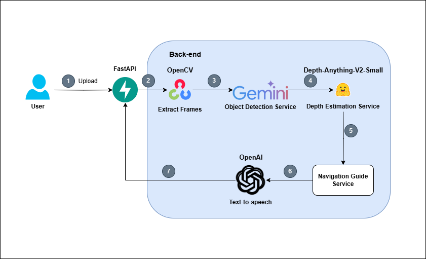

# Video Analysis API

A comprehensive API system for video processing, object detection, depth estimation, navigation guide and text-to-speech capabilities.

## Features

- Video frame extraction at specified intervals
- Object detection in video frames
- Depth estimation for detected objects
- Navigation guidance generation
- Text-to-speech conversion

## Tech Stack

- FastAPI
- OpenCV
- Transformers (Hugging Face)
- OpenAI Text-to-speech API
- Google Gemini API

## **System Architecture**

## Project Structure

```plaintext
├── logs/              # Log files
├── notebooks/         # Jupyter notebooks
├── outputs/           # Output directory
│   ├── frames/        # Extracted video frames
│   └── audio/         # Generated audio files
├── settings/          # Configuration settings
├── src/
│   ├── app.py         # Main application entry point
│   ├── config.py      # Configuration management
│   ├── initializer.py # Model initialization
│   ├── handlers/      # Business logic handlers
│   ├── helpers/       # Helper utilities
│   ├── routers/       # API routes
│   ├── schemas/       # Data models and schemas
│   └── utils/         # Utility functions and constants
├── outputs/           # Output directory
│   ├── frames/        # Extracted video frames
│   └── audio/         # Generated audio files
```

## Setup

1. Clone the repository
    ```bash
    git clone https://github.com/myhoa011/VideoToAudioGuide.git
    cd VideoToAudioGuide
    ```
2. Create a virtual environment (choose one method):

    Using venv:
    ```bash
    python -m venv venv
    source venv/bin/activate  # On Windows: venv\Scripts\activate
    ```

    Using conda:
    ```bash
    conda create -n video2audio python=3.10
    conda activate video2audio
    ```

3. Install dependencies:
    ```bash
    pip install -r requirements.txt
    ```

4. Set up environment variables:
    ```bash
    OPENAI_API_KEY=your_key_here
    GEMINI_API_KEY=your_key_here
    ```

## Running the Application

Start the FastAPI server:

```bash
python src/app.py
```

The API will be available at `http://localhost:8000`

## API Documentation

Once the server is running, you can access:
- API documentation: `http://localhost:8000/docs`
- Alternative documentation: `http://localhost:8000/redoc`

## Features in Detail

### Video Processing
- Extracts frames from videos at specified intervals
- Supports multiple video formats
- Creates organized output directories with timestamps

### Object Detection & Depth Estimation
- Detects objects in video frames
- Estimates depth and distance of detected objects

### Navigation Guide
The navigation system uses a sophisticated Priority Score method to identify and prioritize objects that require the user's attention. 

#### Priority Score Formula
<div align="center">

$P = w_1d + w_2\frac{(x - x_{center})}{W} + w_3\frac{A}{A_{total}} + w_4S_{type}$
</div>

Where:
- $d$: depth value $(0-1)$
- $x$: x-coordinate of object center
- $x_{center}$: x-coordinate of frame center
- $W$: frame width
- $A$: object area
- $A_{total}$: total frame area
- $S_{type}$: priority score based on object type $(0-1)$

#### Weight Distribution
- w1 (Depth) = 0.5: Highest weight as depth is crucial for immediate safety
- w2 (Position) = 0.2: Important for directional guidance
- w3 (Size) = 0.1: Smaller weight as size can be misleading
- w4 (Type) = 0.2: Significant weight for object type importance

#### Object Type Priority Scores
1. High Risk (1.0):
   - People, cars, motorcycles, trucks, buses
   - Highest priority due to movement and collision risk

2. Medium Risk (0.7):
   - Bicycles, dogs, potholes, stairs
   - Significant attention needed but less critical

3. Low Risk (0.4):
   - Traffic lights, stop signs, doors
   - Important for navigation but not immediate threats

4. Minimal Risk (0.2):
   - Benches, walls, trees
   - Static objects with low risk

#### Distance Classification
- "very close" (depth > 0.7): Immediate attention required
- "quite close" (depth > 0.3): Moderate attention needed
- "far away" (depth ≤ 0.3): Minimal immediate concern

#### Navigation Text Generation
- Combines up to 3 highest priority objects
- Groups objects by position (left, center, right)
- Includes warning prefix for close objects
- Generates natural language descriptions
- Example: "Warning! There is a car (very close) directly ahead and a person (quite close) to the left."

### Text-to-Speech
- Converts navigation instructions to speech
- Generates audio files for navigation guidance